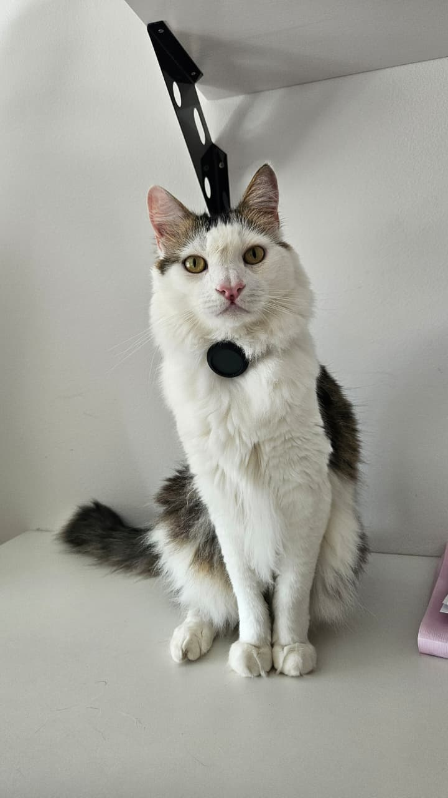
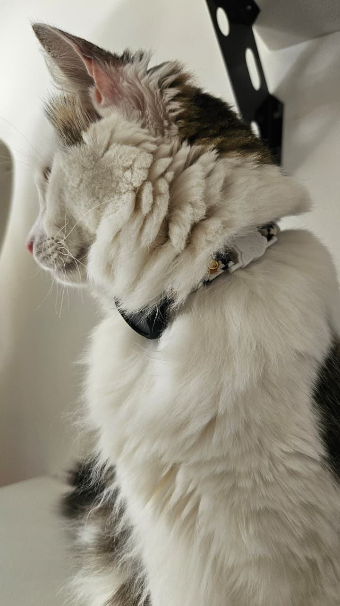
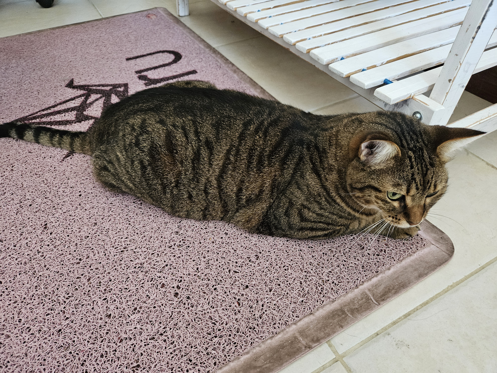
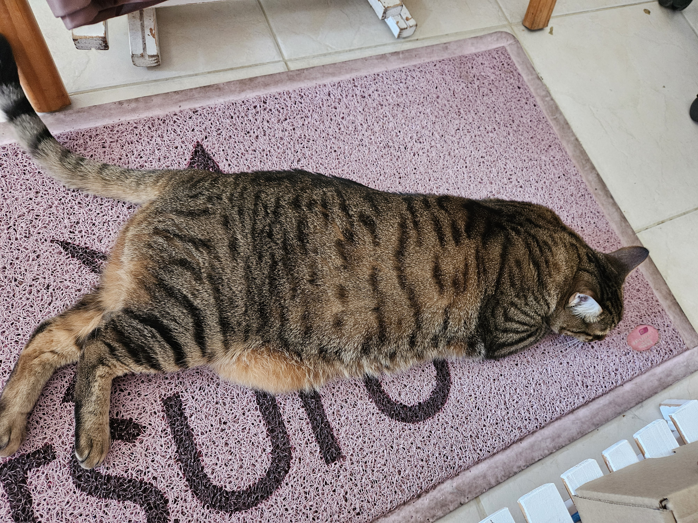

# 🐱 Selective Pet Access

*Safety-critical firmware for an automated, BLE-gated pet feeder — ESP32-S3 · C++20 · FreeRTOS SMP.*

[](https://www.espressif.com/en/products/socs/esp32-s3)
[](https://docs.espressif.com/projects/esp-idf/en/v5.3.4/esp32s3/index.html)
[](https://en.cppreference.com/w/cpp/20)
[](https://www.freertos.org/)
[](https://code.visualstudio.com/docs/devcontainers/containers)

<p align="center">
  
</p>

---

## 📖 About the Project

A real-world embedded system that solves a real problem: two cats, one feeder, and only **Frodo** is supposed to eat from it.

The feeder continuously scans for BLE beacons. Frodo wears a beacon on his collar; when he approaches, the lid opens. Cinnamon, without a collar, is politely denied. The whole thing runs on an **ESP32-S3** with a strictly prioritized **FreeRTOS SMP** task model, ensuring the system responds within hard real-time deadlines — lid opens in the right moment, never stalls, never deadlocks.

The codebase is designed as a reference for **safety-critical firmware quality**: layered architecture, dependency injection, zero heap fragmentation, and a hermetic Docker build environment so any machine produces an identical binary.

---

## 🎬 See it in action

<table>
  <tr>
    <td align="center" width="33%">
      <b>✅ Frodo approaching</b><br>
      <sub>Registered BLE beacon detected — lid opens.</sub><br><br>
      <a href="https://youtu.be/cU2Rki4ZUi0"></a>
    </td>
    <td align="center" width="33%">
      <b>🚫 Cinnamon approaching</b><br>
      <sub>No beacon — lid stays closed.</sub><br><br>
      <a href="https://youtu.be/vrwV5VoLu70"></a>
    </td>
    <td align="center" width="33%">
      <b>🐱🐱 Both cats, one access</b><br>
      <sub>Cinnamon sneaks up while Frodo eats — Frodo leaves, lid closes, Cinnamon gets nothing.</sub><br><br>
      <a href="https://youtu.be/7AZfh4SvZfM"></a>
    </td>
  </tr>
</table>

---

## ⚙️ How it works

The firmware runs five concurrent FreeRTOS tasks at strictly ordered priorities. A BLE scanner feeds beacon events into a lock-free queue; a proximity tracker decides when the registered pet is close enough; the orchestrator state machine drives the lid and LED; a telemetry service polls temperature, humidity, and feed level in the background.

The architecture is intentionally layered: hardware drivers are thin abstractions, business logic has no knowledge of the underlying hardware, and everything is wired together once through dependency injection at startup.

For a full technical breakdown — FSM, task priorities, memory model, and component graph — see **[docs/02_Architecture.md](docs/02_Architecture.md)**.

---

## 🔧 Hardware

<table>
  <tr>
    <td width="50%" align="center">
      <br>
      <sub><b>Lid closed</b> — resting position. Default on boot and after inactivity.</sub>
    </td>
    <td width="50%" align="center">
      <br>
      <sub><b>Lid open</b> — registered beacon in range, servo at commanded angle.</sub>
    </td>
  </tr>
  <tr>
    <td width="50%" align="center">
      <br>
      <sub><b>Sensors</b> — AHT25 (temp/humidity) &amp; VL53L0X (feed level) on the container top.</sub>
    </td>
    <td width="50%" align="center">
      <br>
      <sub><b>Close-up</b> — both I²C sensors sharing the same mounting bracket.</sub>
    </td>
  </tr>
</table>

Full BOM, pin map, and partition layout: **[docs/03_Hardware.md](docs/03_Hardware.md)**.

---

## 🐱 The cats

<table>
  <tr>
    <td width="25%" align="center">
      <br>
      <sub><b>Frodo</b> — wears the BLE beacon collar. ✅ Authorized.</sub>
    </td>
    <td width="25%" align="center">
      <br>
      <sub><b>Frodo</b></sub>
    </td>
    <td width="25%" align="center">
      <br>
      <sub><b>Cinnamon</b> — no collar. 🚫 Access denied.</sub>
    </td>
    <td width="25%" align="center">
      <br>
      <sub><b>Cinnamon</b></sub>
    </td>
  </tr>
</table>

---

## 🚀 Getting started

Prereqs: VS Code · Docker · the Dev Containers extension · ESP32-S3 plugged into USB **before** opening VS Code.

```bash
git clone git@github.com:<you>/selective_pet_access.git
code selective_pet_access              # → click "Reopen in Container"

# Inside the container:
idf.py build
idf.py -p /dev/ttyACM0 flash monitor  # Ctrl+] to exit
```

Full walk-through: **[docs/01_Developer_guide.md](docs/01_Developer_guide.md)**.

---

## 📚 Documentation

| # | Doc | Contents |
|:--:|---|---|
| 01 | [Developer Guide](docs/01_Developer_guide.md) | Build, flash, debug, day-to-day workflow |
| 02 | [Architecture](docs/02_Architecture.md) | FSM, task priorities, component graph, memory model |
| 03 | [Hardware](docs/03_Hardware.md) | BOM, wiring, sensor placement, partition layout |
| 04 | [Environment Setup](docs/04_Environment_setup.md) | From-scratch machine setup, Git/SSH, optional Claude Code |
| 05 | [Contributing](docs/05_Contributing.md) | Code style, RAII contract, how to add a new component |

---

**Author:** João Berlese — [LinkedIn](https://www.linkedin.com/in/joao-berlese/)
