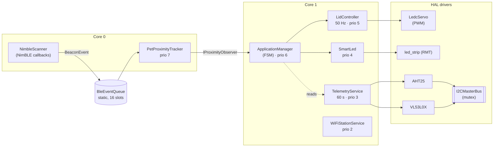
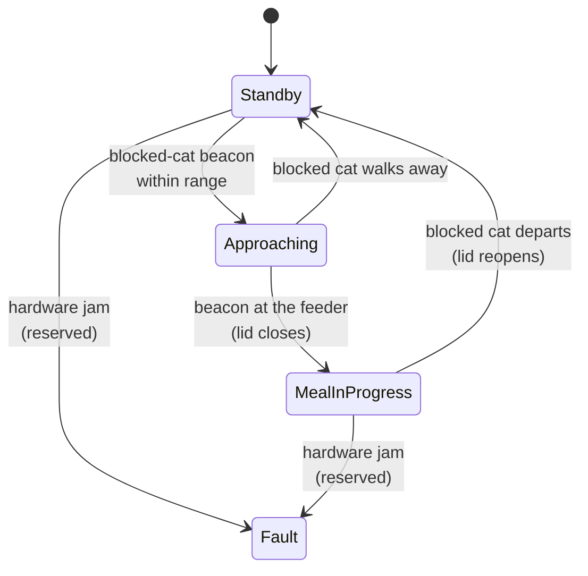

# 02 · Architecture

**Role:** Firmware Engineer reading the repo for the first time.
**Goal:** After this doc you should be able to open any source file and know where it sits in the system.

---

## 1. System in one picture



Everything is assembled in `main/main.cpp` by `pet_access::core::SystemController`. Read that file first — member declaration order is deliberate, because C++ constructs members in declaration order and each later component depends on the ones above it.

---

## 2. Finite State Machine

The feeder has four states. The transitions are driven entirely by `IProximityObserver` callbacks fired by `PetProximityTracker` and by a 5-second inactivity timer inside `ApplicationManager`.

> **Inverted-logic branch:** The enum identifiers (`Standby`, `Approaching`, `MealInProgress`) are unchanged, but their lid mapping is flipped. `Standby`/`Approaching` now hold the lid **open** (default permissive); `MealInProgress` means the blocked-cat beacon is at the feeder and the lid is **closed**.



The two visible FSM states map to physical lid positions:

| State | Lid position | Photo |
|---|---|---|
| `Standby`, `Approaching` | Open |  |
| `MealInProgress` | Closed |  |

`Fault` is reserved for a future jam-detection path (servo stall current + distance sensor disagreement). It is declared but not yet entered by any transition.

---

## 3. Task priorities

Declared in `main/include/sys_config.hpp`. Higher number = harder deadline.

| Prio | Task | Core | Period | Rationale |
|:--:|---|:--:|---|---|
| 7 | `PetProximityTracker` | 0 | event-driven | Drains the BLE queue; must not block the NimBLE host task |
| 6 | `ApplicationManager` (FSM) | 1 | event-driven | Owns the safety-critical state; must preempt actuation |
| 5 | `LidController` | 1 | 50 Hz | Servo PWM update cadence — visible jitter above ~20 ms |
| 4 | `SmartLed` | 1 | event-driven | User-facing feedback; deadline is cosmetic |
| 3 | `TelemetryService` | 1 | 60 s | Background I2C polling; lowest urgency |
| 2 | `WiFiStationService` | 1 | event-driven (backoff) | Non-blocking Wi-Fi connection and exponential backoff retry |

**Core split rationale.** BLE callbacks run on core 0 (where the controller is pinned); the tracker lives there to avoid cross-core IPC latency on every beacon packet. Everything else runs on core 1 so core 0 is free to service the radio.

---

## 4. Cross-component communication

Three decoupling mechanisms, each chosen for a specific reason.

### 4.1 BleEventQueue — FreeRTOS static queue
- **Writers:** NimBLE callback (core 0, ISR-adjacent).
- **Reader:** `PetProximityTracker` task (core 0).
- **Why a queue:** NimBLE callbacks must return quickly or the radio stack backs up. A static queue lets the callback drop an event and return in microseconds; the tracker parses at its own priority.
- **Zero heap:** Declared as a RAII wrapper inside `SystemController` (`BleEventQueue` struct at `main/main.cpp:111`); created in the constructor, destroyed with the object. Backing storage is in `.bss`.

### 4.2 IProximityObserver — interface pointer
- **Publisher:** `PetProximityTracker`.
- **Subscriber:** `ApplicationManager` (exactly one).
- **Why an interface instead of a queue:** Proximity state transitions are rare (seconds apart) and the FSM must react synchronously. Direct virtual dispatch keeps the code obvious and avoids a second queue for trivial traffic.

### 4.3 I2CMasterBus — mutex-protected shared bus
- **Sharers:** `AHT25` and `VL53L0X`.
- **Why a mutex, not a queue:** I2C transactions are short and block-at-bus-level. A mutex serializes access; any caller that wins the mutex owns the bus for the duration of a single transaction. Uses `rtos::LockGuard` + `rtos::StaticMutex` (see **[05 · Contributing](05_Contributing.md)** for the RAII contract).

---

## 5. Dependency injection — why construction order matters

`SystemController` has no setters. Every component receives its dependencies through its constructor, and the order in which members are declared is the order in which they are built. For example:

```cpp
, ble_queue_()                    // must exist before…
, ble_scanner_(ble_queue_.handle) // …the scanner needs a valid queue handle
, i2c_bus_(…)                     // must exist before…
, temp_humidity_sensor_(i2c_bus_) // …any sensor that talks on it
```

If you add a new component, slot it in the declaration list at a position where all of its dependencies are already constructed. Do **not** try to rely on deferred initialization.

---

## 6. Namespaces

| Namespace | Contents |
|---|---|
| `pet_access::bluetooth` | `NimbleScanner`, `BeaconEvent`, `BeaconTypes` |
| `pet_access::sensors` | `AHT25`, `VL53L0X` |
| `pet_access::actuators` | `LedcServo` |
| `pet_access::ui` | `SmartLed` |
| `pet_access::services` | `TelemetryService`, `LidController` |
| `pet_access::tracking` | `PetProximityTracker`, `IProximityObserver` |
| `pet_access::network` | `WiFiStationService`, `WiFiStatus`, `IWiFiObserver` |
| `pet_access::core` | `SystemController`, `ApplicationManager` |
| `pet_access::sys` | Task priorities (`sys_config.hpp`) |
| `pet_access::board` | GPIO pin map (`board_mapping.hpp`) |
| `pet_access::rtos` | `StaticMutex`, `LockGuard` |
| `pet_access::i2c` | `I2CMasterBus` |

---

## 7. Memory model

- **Every RTOS primitive is static.** Tasks, queues, mutexes live in `.bss` (internal SRAM/DRAM) — zero heap, zero fragmentation.
- **No RTOS primitive may live in Octal PSRAM.** Placing mutexes in external RAM causes scheduler latency spikes on cache miss. If you need PSRAM for a data buffer, use `EXT_RAM_BSS_ATTR` (static) or `heap_caps_malloc(..., MALLOC_CAP_SPIRAM)` (dynamic); never allocate FreeRTOS objects there.
- **Exceptions and RTTI are disabled** (`-fno-exceptions`, `-fno-rtti`). Error handling uses `esp_err_t` at the HAL layer and `std::optional<T>` at the service-API layer.

---

## Where to go next

| Need | Doc |
|---|---|
| The physical build and partition table | [03 · Hardware](03_Hardware.md) |
| Code style, RAII contract, how to add a component | [05 · Contributing](05_Contributing.md) |
| Running the firmware | [01 · Developer Guide](01_Developer_guide.md) |
