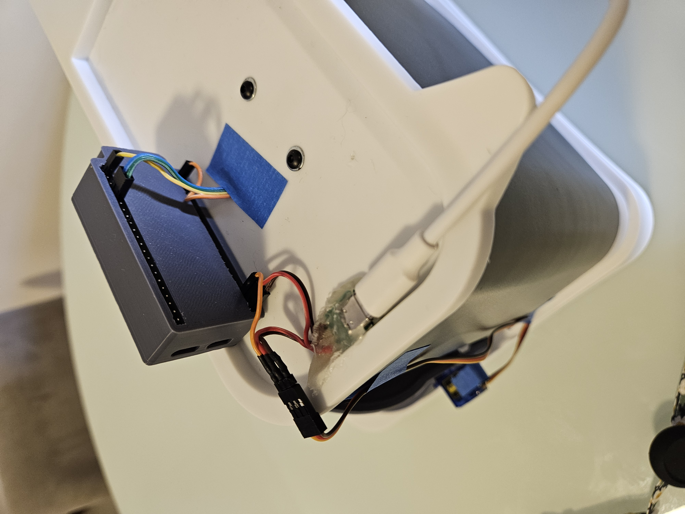
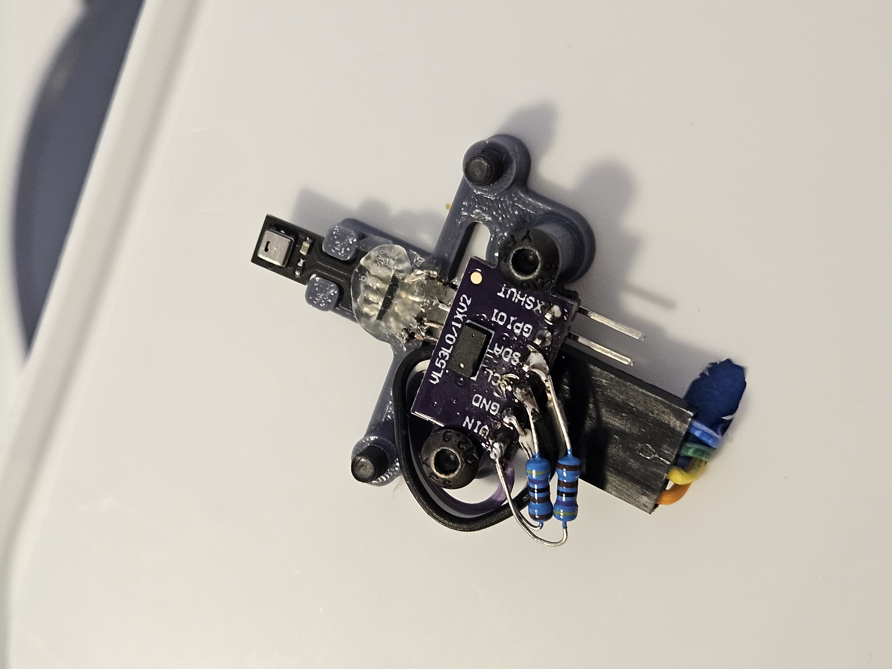
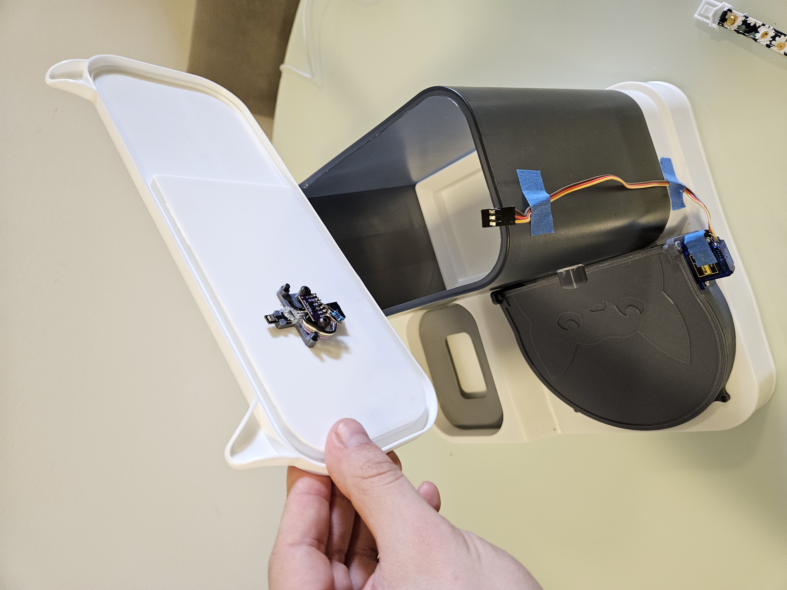
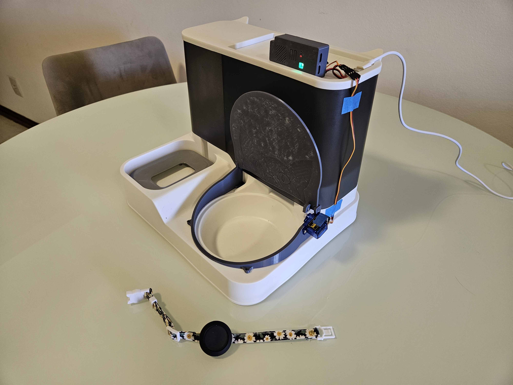
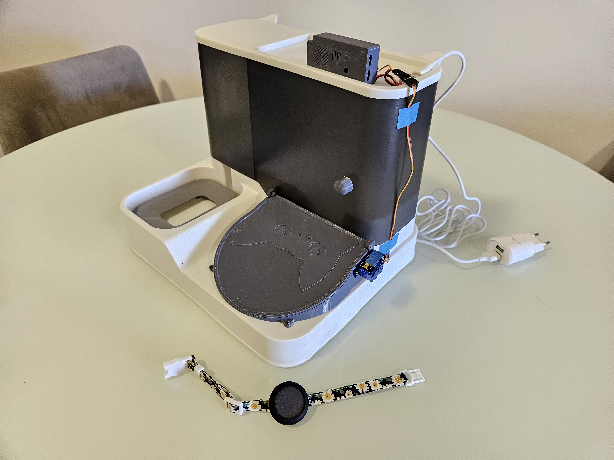

# 03 · Hardware

**Role:** Anyone wiring up, replicating, or debugging the physical unit.

---

## 1. The build



The ESP32-S3-N16R8 sits on the top deck. All wiring is routed through a single harness: the servo cable runs to the front of the unit, the I²C bus sensors are clustered at the food chamber, and the addressable RGB LED sits on top as a status beacon.

---

## 2. Bill of materials

| Role | Part | Notes |
|---|---|---|
| Mechanical base | Gravity pet feeder (comedouro/bebedouro) | [Buy on Mercado Livre](https://www.mercadolivre.com.br/bebedouro-e-comedouro-alimentador-gravidade-pet-ces-gatos-cor-cinza/p/MLB45745962?pdp_filters=item_id%3AMLB5271769154&matt_tool=38524122#origin=share&sid=share&wid=MLB5271769154&action=copy) — structural chassis for all modifications |
| MCU | ESP32-S3-N16R8 | 16 MB QIO flash, 8 MB Octal PSRAM, built-in USB-JTAG |
| Actuator | SG90 9 g micro servo | PWM @ 50 Hz, 500–2400 µs pulse, 0–180° sweep |
| Temp / humidity | AHT25 (I²C) | Inside the food chamber |
| Distance / feed level | VL53L0X ToF (I²C) | Pointed down into the bowl |
| Status indicator | WS2812B single pixel | RMT-driven addressable LED |
| Pet beacon | Eddystone-UID BLE beacon · **Bundle B** | [Buy on AliExpress](https://pt.aliexpress.com/item/1005007270576203.html?spm=a2g0o.order_list.order_list_main.5.23bc1802GbV6kn&gatewayAdapt=glo2bra) — Instance ID `FD A5 06 93 A4 E2` (see `main/main.cpp:40`) |

---

## 3. Pin mapping

The single source of truth is `main/include/board_mapping.hpp`. Current assignments:

| Function | Pin | Constant |
|---|:--:|---|
| Status LED (WS2812B / RMT) | `GPIO 48` | `board::PIN_LED_STRIP` |
| Servo PWM | `GPIO 14` | `board::PIN_SERVO` |
| I²C SDA | `GPIO 1` | `board::I2C_SDA_PIN` |
| I²C SCL | `GPIO 2` | `board::I2C_SCL_PIN` |
| I²C bus | `I2C_NUM_0` @ 100 kHz | `board::I2C_PORT` |

Change pins in `board_mapping.hpp` only. Do not hard-code GPIO numbers anywhere else.

---

## 4. Sensor placement

The sensor choices and their physical mounting directly bound the telemetry thresholds used by `TelemetryService`.

| Sensor | Photo |
|---|---|
| **AHT25** — ambient temperature & humidity inside the chamber. Mount away from the servo (self-heats under stall) and away from the bowl interior to avoid moisture pooling on the sensor. |  |
| **VL53L0X** — Time-of-Flight distance sensor pointed vertically down into the bowl. The reported distance is inverted to a *fill level*; the zero reference is the sensor-to-empty-bowl distance measured at calibration. |  |

Both sensors share the I²C bus via `i2c::I2CMasterBus`, which serializes transactions with a mutex. See **[02 · Architecture §4.3](02_Architecture.md#43-i2cmasterbus--mutex-protected-shared-bus)**.

---

## 5. Actuator — lid servo

The lid has two mechanically defined positions. The servo config lives at `main/main.cpp:133`:

```cpp
.min_pulse_us = 500,
.max_pulse_us = 2400,
.max_angle_deg = 180.0f
```

> **Inverted-logic branch:** the lid's resting position is flipped — it boots **open** and only **closes** while the blocked-cat beacon is at the feeder.

| State | Photo |
|---|---|
| **Lid open** — resting position. Default on boot and whenever the blocked-cat beacon is out of range. |  |
| **Lid closed** — reached only when the blocked-cat beacon is within range and proximity is stable at the feeder. |  |

`LidController` runs a 50 Hz update loop (priority 5). Servo command updates below 20 ms are imperceptible to the mechanism; the loop is bound by PWM hardware, not by the FSM's decision rate.

---

## 6. Flash partition layout

Defined in `partitions.csv`. Total 16 MB.

| Partition | Type | Size | Purpose |
|---|---|---|---|
| `nvs` | data/nvs | 24 KB | Non-volatile key/value — WiFi creds, device ID, operational flags |
| `otadata` | data/ota | 8 KB | Bootloader state — which app slot is active/bootable |
| `phy_init` | data/phy | 4 KB | RF calibration data (BLE radio tuning) |
| `ota_0` | app | **3 MB** | Factory / active application |
| `ota_1` | app | **3 MB** | OTA download slot with safe rollback |
| `storage` | data/spiffs | 9 MB | Filesystem for logs, pet registry, offline assets |
| `coredump` | data/coredump | 128 KB | Panic stack trace — survives reboot |

**Why 3 MB per OTA slot.** Stock ESP32 examples use 1 MB slots, which is tight for a Modern C++ binary (templates, vtables, extensive logging). Doubling to 3 MB leaves headroom for future features (WiFi, MQTT, larger HAL drivers).

**Why a dedicated coredump partition.** Field panics need a stack trace without a JTAG probe attached. ESP-IDF's panic handler writes the core dump here before the reboot; pulling it back over serial gives us post-mortem GDB without interrupting a user.

---

## 7. PSRAM usage rules

The board has 8 MB of Octal PSRAM configured in `sdkconfig.defaults` (`CONFIG_SPIRAM_MODE_OCT=y`). Rules of the road:

- **Never put RTOS primitives in PSRAM.** Mutexes, task control blocks, queues — all must live in DRAM. PSRAM cache misses introduce scheduler latency spikes during context switches.
- **Do put large data buffers in PSRAM.** Use `EXT_RAM_BSS_ATTR` for static buffers; use `heap_caps_malloc(..., MALLOC_CAP_SPIRAM)` only if dynamic allocation is unavoidable.
- **DMA alignment.** If a PSRAM buffer ever feeds a DMA-backed peripheral (SPI, I²S), verify alignment and cache coherence. This project currently does not DMA to/from PSRAM.

---

## 8. JTAG / serial

- The ESP32-S3 has built-in USB-JTAG. Connect via the **USB** port, not the UART port.
- Inside the Dev Container the device always appears as `/dev/ttyACM0`.
- OpenOCD uses `board/esp32s3-builtin.cfg`; F5 in VS Code halts the chip.
- If flash fails with a timeout, put the chip in bootloader mode: hold `BOOT`, press `RST`, release `BOOT`, retry.

---

## 9. 3D Mechanical design

The custom lid mount, servo bracket, and sensor housing were designed in Onshape and are publicly accessible:

**[Open CAD project on Onshape](https://cad.onshape.com/documents/6f40efa1f36a90fcf6397240/w/0a5a0feb560c707967c8b055/e/a400aabde5c6b8c67bfb5760)**

All parts have been successfully 3D-printed and the full mechanical assembly is currently functional.
